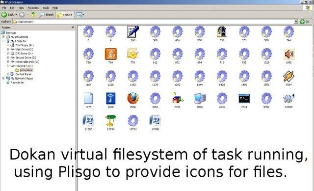
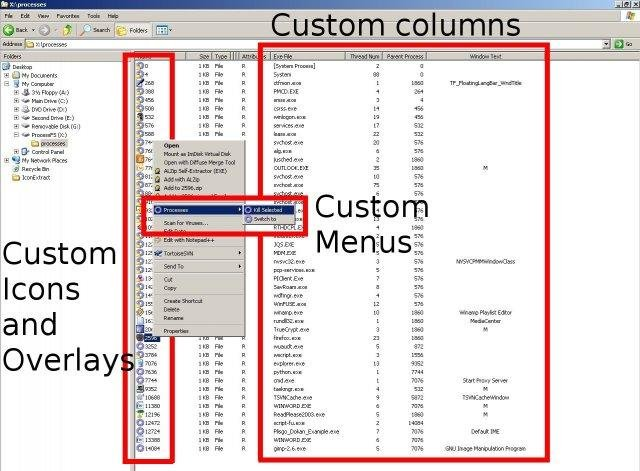

Plisgo
------

This was a generic Windows Explorer shell extension system. Beyond this file and it's images, the code is as was on [SourceForge](https://sourceforge.net/projects/plisgo/)

I've put it here as a modern place to find a chunk of Windows Explorer shell code for any one who wants it. The same kind of thing can no doubt be found in [TortoiseSVN](https://tortoisesvn.net/) and [TortoiseGit](https://tortoisegit.org/), but maybe one more reference point is helpful to someone.

The idea was the API was done at the file level. Like with .svn or .git
but that the the defined was menus and icons of the shell extension.

The system was used with a Dokan virtual filesystem and an example of 
one is included in the source.

[Dokan](https://dokan-dev.github.io) continued, but has no doubt left the included example long behind, but I hope this is useful to someone.